

 

 

# 👶SUBSIDIOS:

# 🌚REDES SOCIAIS:
 
 
  

# 👨‍💻COMO PROGRAMADOR:
## ( 00 ) CONHECIMENTO GERAL

<a href="https://github.com/VILHALVA/CURSO-DE-HARDWARE" target="_blank" rel="noreferrer">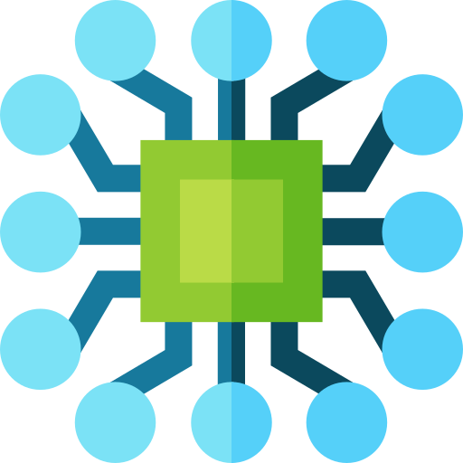</a>
<a href="https://github.com/VILHALVA/CURSO-DE-BASES-NUMERICAS" target="_blank" rel="noreferrer">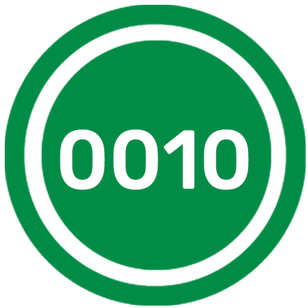</a>

## [( 01 ) CRIAÇÃO DE SITES](https://github.com/VILHALVA?tab=repositories&q=+topic:SITE)

 
<a href="https://github.com/VILHALVA/CURSO-DE-HTML-E-CSS" target="_blank" rel="noreferrer">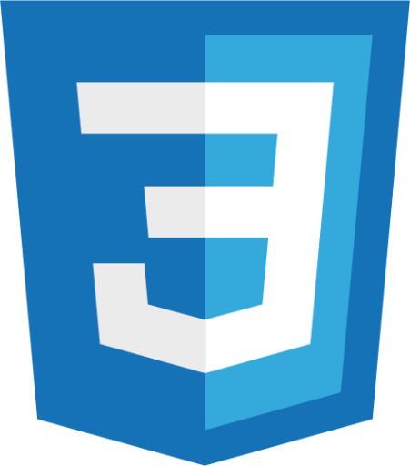</a> 

<a href="https://github.com/VILHALVA/CURSO-DE-TYPESCRIPT" target="_blank" rel="noreferrer"> 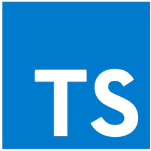</a>
 
<a href="https://github.com/VILHALVA/CURSO-DE-RUBY" target="_blank" rel="noreferrer">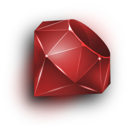</a>

<a href="https://github.com/VILHALVA/CURSO-DE-NODEJS" target="_blank" rel="noreferrer">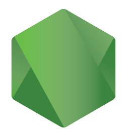</a>
<a href="https://github.com/VILHALVA/CURSO-DE-NODEJS-COM-MYSQL" target="_blank" rel="noreferrer">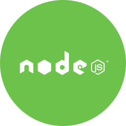</a>
 
 

<a href="https://github.com/VILHALVA/CURSO-DE-ANGULAR" target="_blank" rel="noreferrer">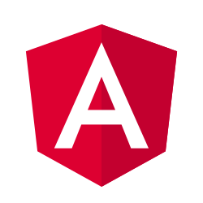</a>

## [( 02 ) CRIAÇÃO DE APLICATIVOS](https://github.com/VILHALVA?tab=repositories&q=+topic:APLICATIVO)

 
<a href="https://github.com/VILHALVA/CURSO-DE-KOTLIN" target="_blank" rel="noreferrer"> 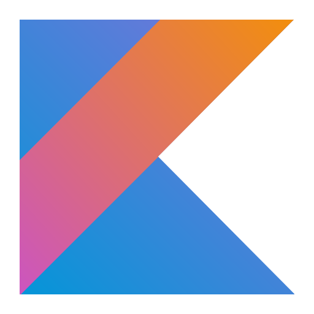</a>

 

<a href="https://github.com/VILHALVA/CURSO-DE-ANDROID-STUDIO-EM-KOTLIN" target="_blank" rel="noreferrer">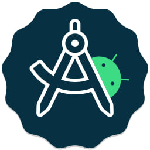</a>

<a href="https://github.com/VILHALVA/CURSO-DE-VISUAL-STUDIO-2022" target="_blank" rel="noreferrer">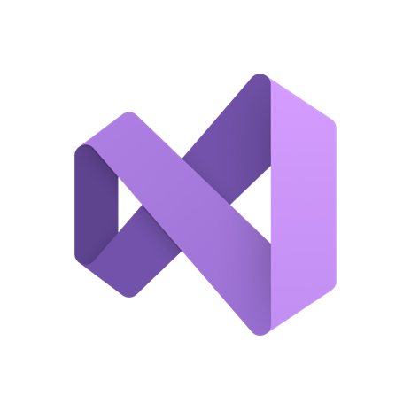</a>

<a href="https://github.com/VILHALVA/CURSO-DE-TKINTER" target="_blank" rel="noreferrer">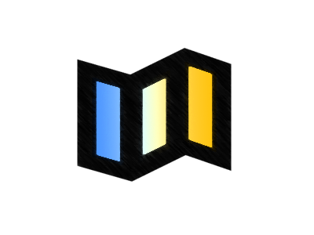</a>

## [( 03 ) CRIAÇÃO DE ROBÔS](https://github.com/VILHALVA?tab=repositories&q=+topic:BOT)

<a href="https://github.com/VILHALVA/CURSO-DE-LOGICA-COM-PYTHON" target="_blank" rel="noreferrer">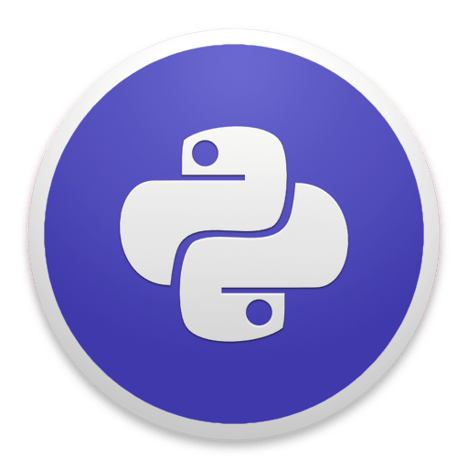</a>
<a href="https://github.com/VILHALVA/CURSO-DE-MESTRE-DO-PYTHON" target="_blank" rel="noreferrer">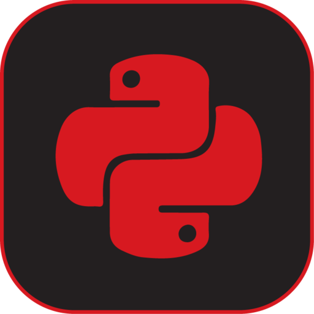</a>

<a href="https://github.com/VILHALVA/CURSO-DE-AUTOMACAO" target="_blank" rel="noreferrer">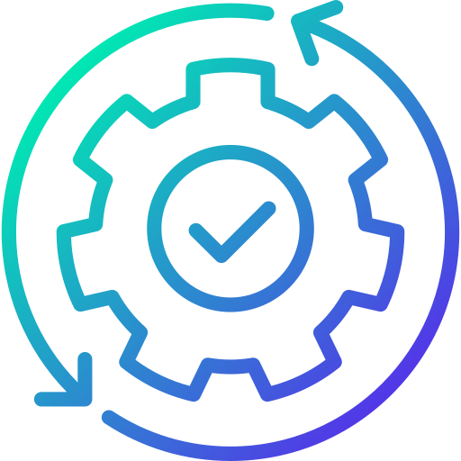</a>

## [( 04 ) CRIAÇÃO DE JOGOS](https://github.com/VILHALVA?tab=repositories&q=+topic:JOGO)

<a href="https://github.com/VILHALVA/CURSO-DE-C-PLUS-PLUS" target="_blank" rel="noreferrer">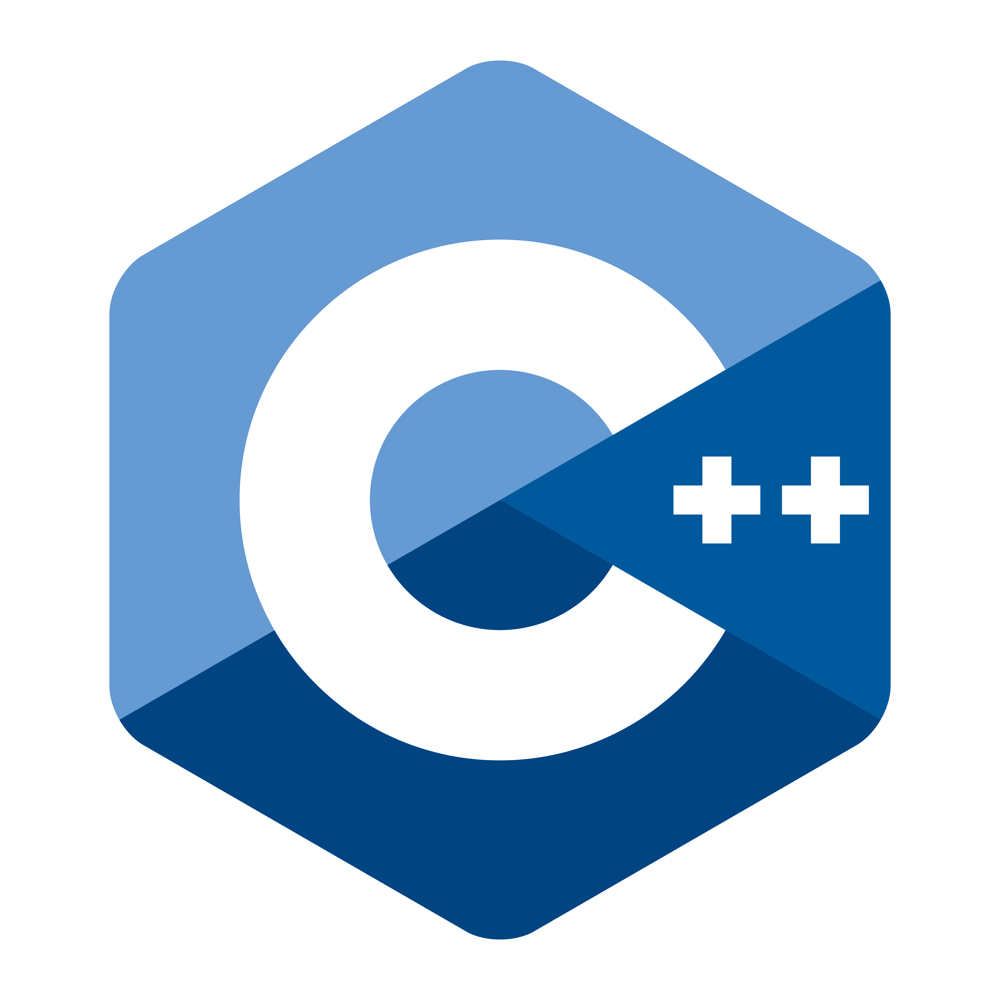</a>

<a href="https://github.com/VILHALVA/CURSO-DE-UNITY" target="_blank" rel="noreferrer">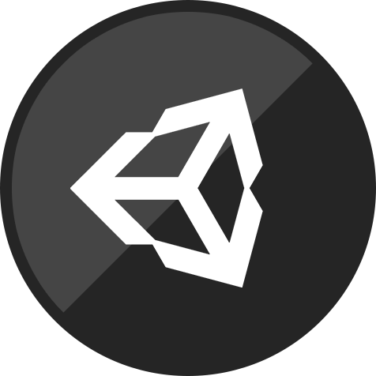</a>
 
 
  

 

