

 

 

# 👶SUBSIDIOS:

# 🌚REDES SOCIAIS:
 
 
  

# [👨‍💻MEUS CURSOS](https://github.com/VILHALVA?tab=repositories&q=+topic:CURSO)
> 👇CLIQUE NAS FOTOS PARA EXPLORAR OS CURSOS!

## ( 01 ) TEORIA/TEORICO

## ( 02 ) LINGUAGENS/MARCADORES
 

 

 

 

<a href="https://github.com/VILHALVA/CURSO-DE-DART">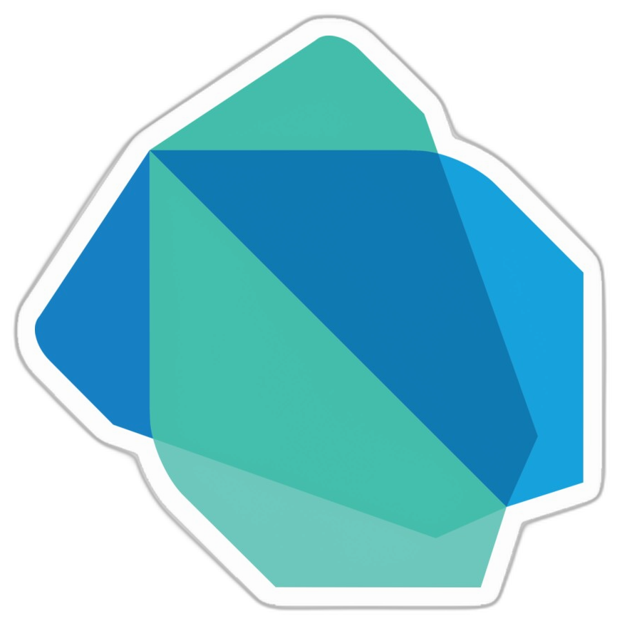</a>

 

<a href="https://github.com/VILHALVA/CURSO-DE-GDSCRIPT">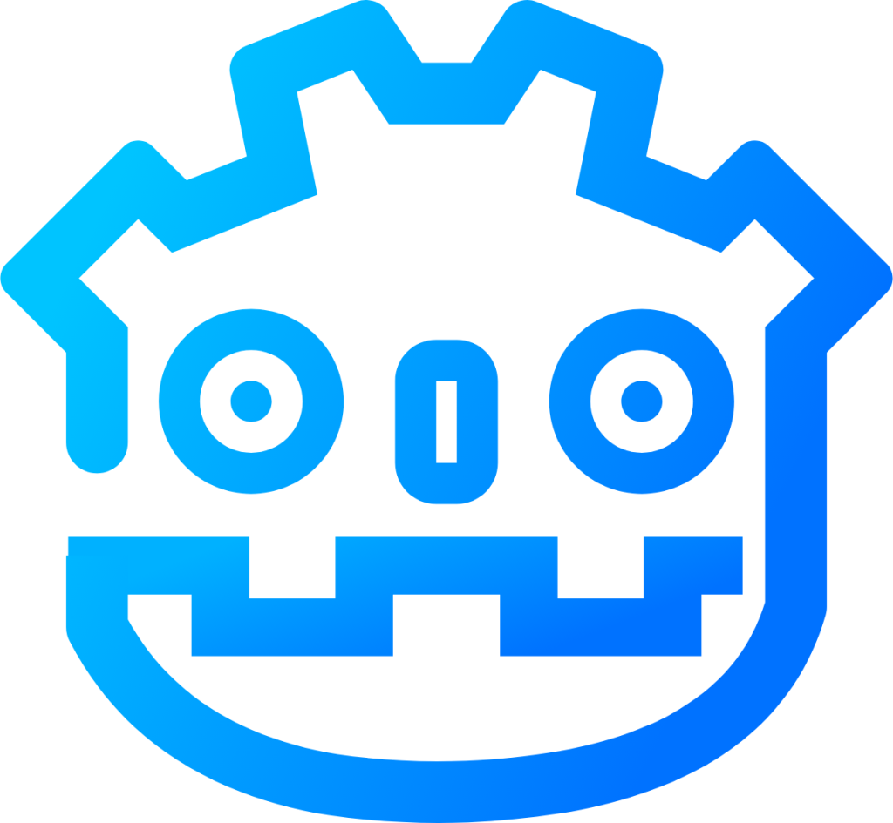</a>
<a href="https://github.com/VILHALVA/CURSO-DE-BATCH-SCRIPT">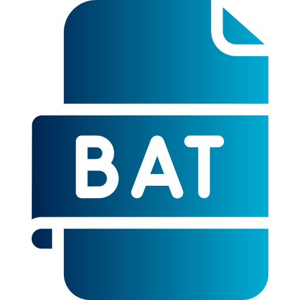</a>

## ( 03 ) FRAMEWORKS/BIBLIOTECAS

<a href="https://github.com/VILHALVA/CURSO-DE-PYSCRIPT">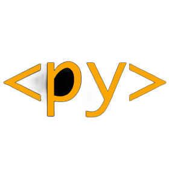</a>
<a href="https://github.com/VILHALVA/CURSO-DE-PANDAS">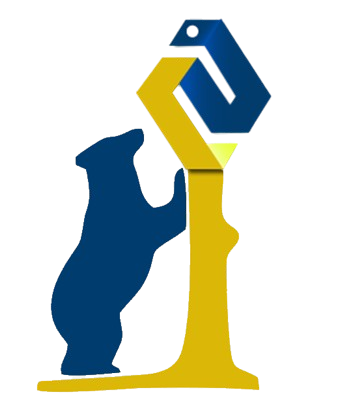</a>

<a href="https://github.com/VILHALVA/CURSO-DE-TAURI">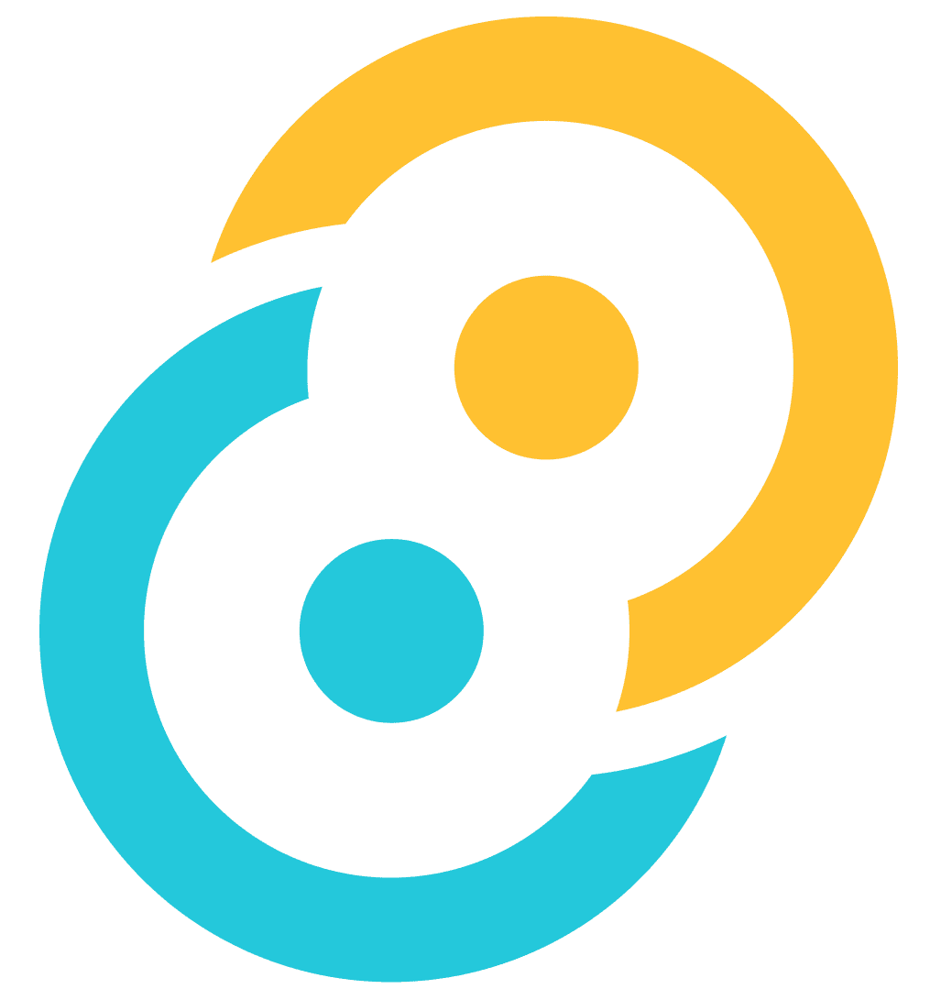</a>

<a href="https://github.com/VILHALVA/CURSO-DE-PYQT">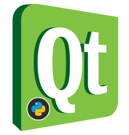</a>
<a href="https://github.com/VILHALVA/CURSO-DE-PYSIDE">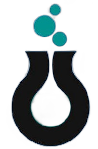</a>

## ( 04 ) FERRAMENTAS/TECNOLOGIAS

 

 
<a href="https://github.com/VILHALVA/CURSO-DE-PYTHON-COM-SQLITE">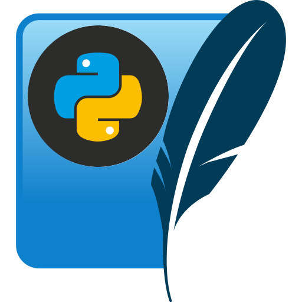</a>

<a href="https://github.com/VILHALVA/CURSO-DE-ANDROID-STUDIO-EM-JAVA">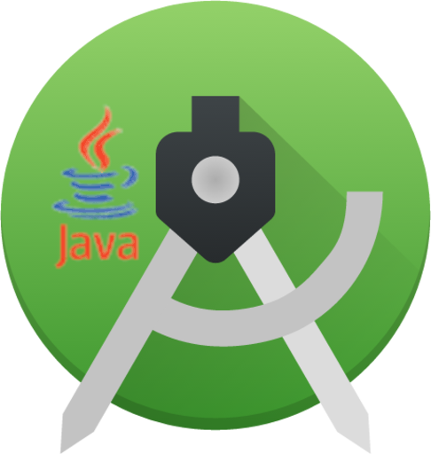</a>
<a href="https://github.com/VILHALVA/CURSO-DE-ANDROID-STUDIO-EM-KOTLIN">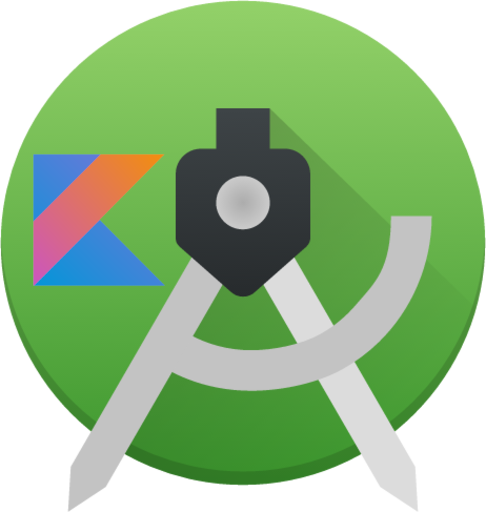</a>
<a href="https://github.com/VILHALVA/CURSO-DE-VISUAL-STUDIO">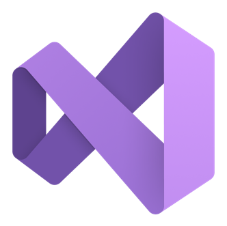</a>

<a href="https://github.com/VILHALVA/CURSO-DE-MICROSOFT-BOT-FRAMEWORK">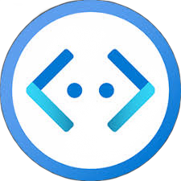</a>
<a href="https://github.com/VILHALVA/CURSO-DE-CONSTRUCT">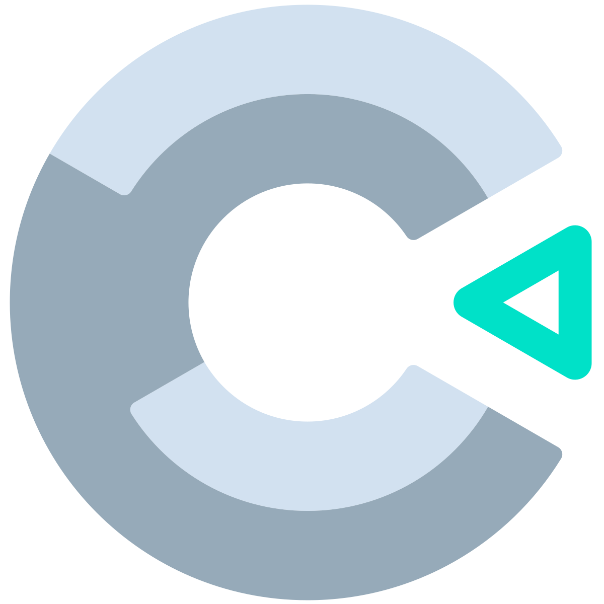</a>

 

# [👨‍💻MEUS PROJETOS](https://github.com/VILHALVA?tab=repositories&q=+topic:PROJETO)
> 👇CLIQUE NOS BOTÕES E NAS FOTOS PARA EXPLORAR OS PROJETOS!

## [( 01 ) CRIAÇÃO DE SITES](https://github.com/VILHALVA?tab=repositories&q=+topic:SITE)

 
 
 
 

 

 
 

 

 

<a href="https://github.com/VILHALVA?tab=repositories&q=+topic:FIREBASE">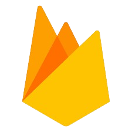</a>

 

## [( 02 ) CRIAÇÃO DE APLICATIVOS](https://github.com/VILHALVA?tab=repositories&q=+topic:APLICATIVO)

<a href="https://github.com/VILHALVA?tab=repositories&q=topic:EXE">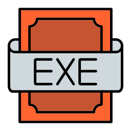</a>

## [( 03 ) CRIAÇÃO DE BOTS](https://github.com/VILHALVA?tab=repositories&q=+topic:BOT)

## [( 04 ) CRIAÇÃO DE JOGOS](https://github.com/VILHALVA?tab=repositories&q=+topic:JOGO)

<a href="https://github.com/VILHALVA?tab=repositories&q=topic:PYTHON-GAME">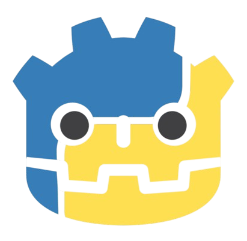</a>

<a href="https://github.com/VILHALVA?tab=repositories&q=topic:HTML-GAME">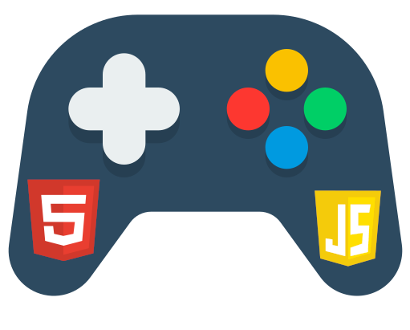</a>

 

# 📊ESTATÍSTICAS

  <a href="https://github.com/VILHALVA">
  
  

